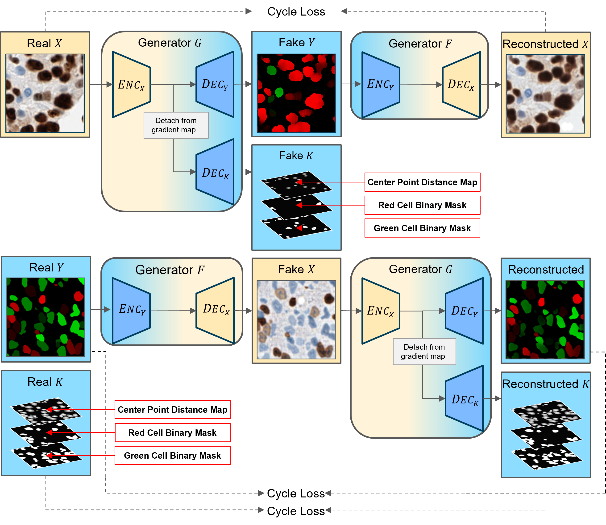
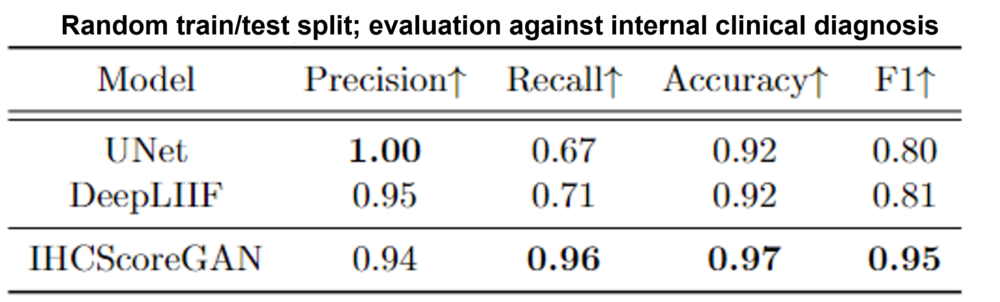
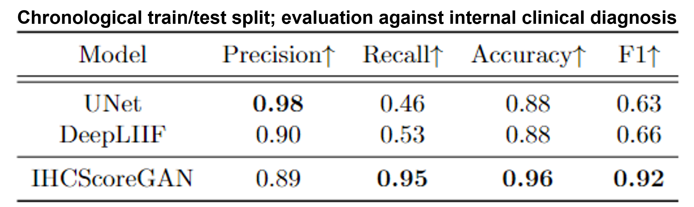
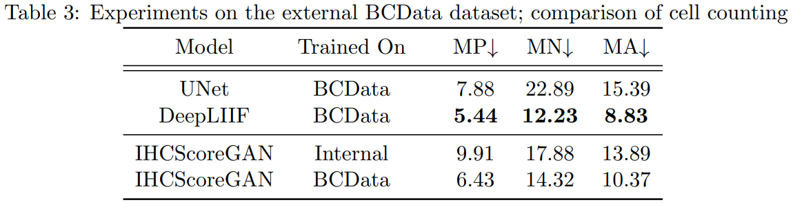

# IHCScoreGAN - Official PyTorch Implementation

<p align="center"></p>

> **IHCScoreGAN: An unsupervised generative adversarial network for end-to-end ki67 scoring for clinical breast cancer diagnosis**
>
> **Abstract:** Ki67 is a biomarker whose activity is routinely measured and scored by pathologists through immunohistochemistry (IHC) staining, which informs clinicians of patient prognosis and guides treatment. Currently, most clinical laboratories rely on a tedious, inconsistent manual scoring process to quantify the percentage of Ki67-positive cells. While many works have shown promise for Ki67 quantification using computational approaches, the current state-of-the-art methods have limited real-world feasibility: they either require large datasets of meticulous cell-level ground truth labels to train, or they provide pre-trained weights that may not generalize well to in-house data. To overcome these challenges, we propose IHCScoreGAN, the first unsupervised deep learning framework for end-to-end Ki67 scoring without the need for any ground truth labels. IHCScoreGAN only requires IHC image samples and unpaired synthetic data, yet it learns to generate colored cell segmentation masks while simultaneously predicting cell center point and biomarker expressions for Ki67 scoring, made possible through our novel dual-branch generator structure. By removing ground truth requirements, our unsupervised technique constitutes an important step towards easily-trained Ki67 scoring solutions which can train on out-of-domain data in an unsupervised manner.

This codebase is an official implementation of the relevant work, which was accepted for publication in MIDL 2024. You can find the associated paper at https://openreview.net/pdf?id=U3vfFn9WQ7.

## Usage

### Training

To train the model, you must populate the `trainA` and `trainB` folders with source (IHC) and target (synthetic) datasets. 

The `trainA` data used in our publication's external dataset experiments can be obtained by downloading the [BCData dataset](https://sites.google.com/view/bcdataset) and splitting the resulting input images into 256x256 tiles. The internal dataset experiments' data files have not been made publicly available.

The `trainB` data used in our publication is publicly available at https://zenodo.org/records/11396999 with the files located under the `Training_Target_Dataset` directory. As mentioned in the associated publication, this target dataset has been extracted from TCGA's Breast Carcinoma project, consisting of 23 H&E slides.

Before training, your folder structure should look like:

```
└── dataset
    └── trainA
        └── name_of_trainA_img.png
            ...
    └── trainB
        └── json
            └── name_of_trainB_file.json
            ...
        └── overlay
            └── name_of_trainB_img.png
            ...
├── .gitignore
├── IHCScoreGAN.py
├── README.md
├── dataset.py
├── main.py
├── modules.py
└── utils.py
```

You can then run the model from the `main.py` file or through your terminal window, like so:

```
python main.py --exp_name bcdataset --phase train --num_workers 8 --batch_size 4 --input_dir dataset --resume False
```

### Testing

To test the model, you must populate the `testA` folder with source (IHC) datasets. 

The model weights used in our publication's external dataset experiments are publicly available at https://zenodo.org/records/11396999 with the file named `IHCScoreGAN_Weights_BCData_Latest.pt`.

The `trainA` data used in our publication's external dataset experiments can be obtained by downloading the [BCData dataset](https://sites.google.com/view/bcdataset) and splitting the resulting input images into 256x256 tiles. The internal dataset experiments' data files have not been made publicly available.

Your folder structure should look like:

```
└── dataset
    └── testA
        └── name_of_testA_img.png
            ...
└── results
    └── <experiment name>
        └── model
            └── model_weights_file.pt
├── .gitignore
├── IHCScoreGAN.py
├── README.md
├── dataset.py
├── main.py
├── modules.py
└── utils.py
```

You can then run the model from the `main.py` file or through your terminal window, like so:
```
python main.py --exp_name bcdataset --phase test --num_workers 8 --batch_size 4 --load_path results/<experiment name>/model/model_weights_file.pt --results_dir results --save_images True
```

## Results

### Internal Dataset Experiments

<details>
  <summary>Supplementary Information</summary>

We performed two two-split experiment on our internal dataset to reflect the performance for the model in a general use-case. In both experiments, we drew 1,532 cases in the train split and 594 cases in the test split, with tiles corresponding to the cases aggregated into their split. We then evaluated against the real clinical diagnosis of the patient, with cases thresholded at a commonly accepted 20% cutoff point.
</details>

<p align="center"></p>
<p align="center"></p>

### External Dataset Experiments

<details>
  <summary>Supplementary Information</summary>

We validated our framework on a public breast cancer dataset, [BCData](https://sites.google.com/view/bcdataset). We compared cell counting of our framework against two supervised models, both of which were trained using BCData’s training images and cell annotation labels. The results are in Table 3, where "MP", "MN", and "MA" represents the Mean Absolute Error (MAE) of positive, negative, and the average value, respectively.
</details>

<p align="center"></p>

## Reference
If you find our work useful in your research, and/or if you use parts of this code or its corresponding public files, please cite the paper as follows:

```
@inproceedings{molnarihcscoregan,
  title={IHCScoreGAN: An unsupervised generative adversarial network for end-to-end ki67 scoring for clinical breast cancer diagnosis},
  author={Molnar, Carl and Tavolara, Thomas E and Garcia, Christopher A and McClintock, David S and Zarella, Mark D and Han, Wenchao},
  booktitle={Medical Imaging with Deep Learning}
}
```
